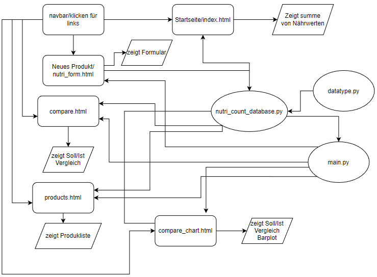

#**Problembeschreibung/Motivation**

Dies Projekt wurde gewählt, da ich den Use-Case als sinnvoll erachte 
und ich wusste, dass es den Ansprüchen der Datenverarbeitung genügen wird(Mit Dozent besprochen).
Ich dachte mir, dass könnte man brauchen.

Das Projekt Hilft dem User dabei, die Kontrolle über die Nahrungszufur zu überwachen.

Das Projekt zählt die Nährwerte zusammen und vergleicht diese mit 
dem empfohlenen Sollwert.

#**Betrieb**
Sämtliche Pakete die für den Betrieb nötig sind, werden vom Programm bereitgestellt.
1. Lade alle Dateien aus dem Github herunter.
2. Führe das Kommando: "py main.py" im Terminal aus, um den Server zu starten.

#**Benutzung**
1. Man gibt die geforderten Werte des Produktes ein. 
   **Wichtig: keine Buchstaben eingeben wo Zahlen gefordert sind! "." benutzen kein ","**
2. Danach klickt auf "Hinzufügen!" und erhält eine Bestätigung.
3. Das Produkt wird der Produktliste hinzugefügt.
4. Die Nährwerte werden addiert und auf der Startseite dargestellt.
5. Die Soll und Ist Werte werden miteinander verglichen und ebenfalls ausgegeben.

#**Architektur**

1. main.py rendert die einzelnen html files und enthält die Logik des Barcharts.
2. nutri_count_database.py enthält sämtliche Berechnungen.
3. datatype.py die Datenklassen der Werte für die Berechnungen.
4. database.csv dient als datenspeicher der Produktdaten.

#**Ungelöste/unbearbeitete Probleme**

Verbesserungen: Geschlechtsauswahl, zwischen m&w.
Das Löschen und/oder korrigieren der einzelnen Produkte.
Das Speichern einzelner Produkte für die Schnellwahl.

Wurde alles etliche Stunden lang versucht... 
Doch leider nicht erfolgreich.

#**Würde ich nächstes mal anders machen:**

Nächstes mal würde ich definitiv auf JSON setzen!

#**Source Bucket(NICHT VOLLSTÄNDIG):**

https://getbootstrap.com/docs/4.0/components/card/#header-and-footer

https://www.w3schools.com/css/tryit.asp?filename=trycss_image_text_center

https://www.chartjs.org/docs/latest/samples/bar/vertical.html

https://dev.to/ivanadokic/data-visualization-with-chart-js-4g0g

https://www.createwithdata.com/chartjs-and-csv/

https://www.tabnine.com/code/javascript/functions/builtins/HTMLElement/getContext

https://www.geeksforgeeks.org/how-to-plot-bar-graph-in-python-using-csv-file/

https://stackoverflow.com/questions/68357753/how-do-i-convert-csv-data-into-bar-chart